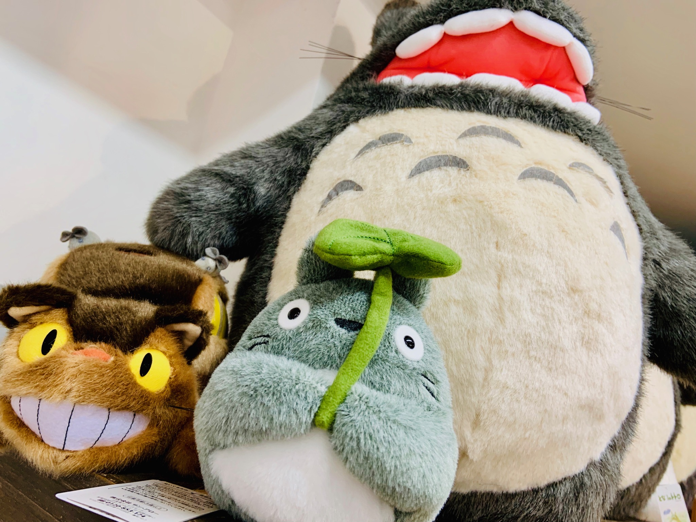
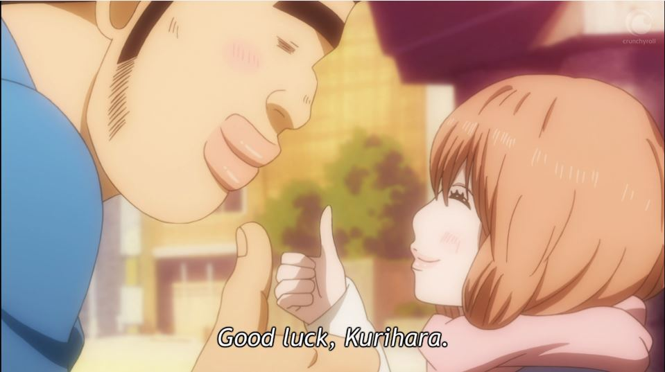
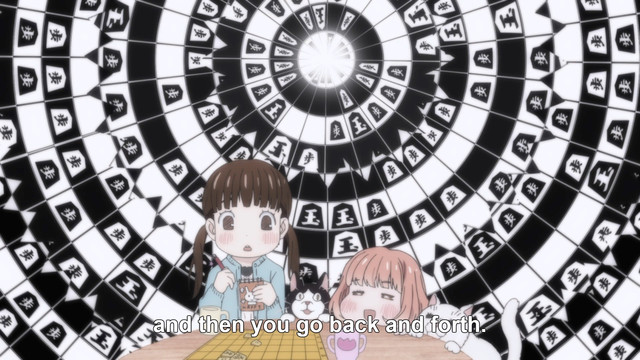
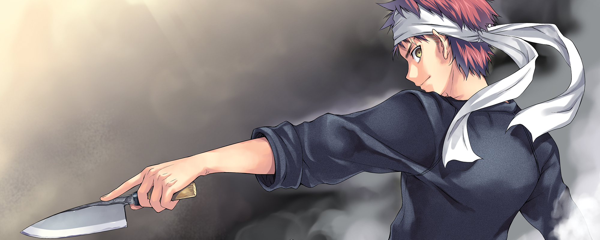

It sometimes feels like my memory is shorter than a cut bonsai. Even though
watching anime has become one of our favorite pasttimes nowadays, every time I
want to share some Anime recommendations I find myself with a complete blank.
Emptier than Shorty's 🐶 belly when the door to the kitchen opens.

So I'm writing this post as much as a message to you, as well as a personal
reminder of the anime that we've watched and loved. It's not really meant as a
review list of our favorite anime, but rather a list of our personal
recommendations that you can watch if you find yourself in need of random
entertainment

### My Love Story!!
*Slice of Life | Romance*

If you ever find yourself in a need for a pick me up, this anime is going to do
the trick. It's so uplifting and sweet, it's addictive to watch.
Also, rather short, with 2 seasons it's perfect for 2 days of non-stop anime
goodness.

It's just like an excellent cake, you shouldn't overdo it, but man are those
moments when you indulge to be enjoyed! 😊Don't let yourself be put off by the
cheesy title, the anime is a lot more than it sounds like.

Image source: [diehardgamefan.com](http://diehardgamefan.com/2015/08/05/diehard-animefan-vol-2-my-love-story-monster-musume-god-eater-bakemonogatari/)

### March comes in like a lion
*Slice of Life | Shogi*

I find it fascinating how anime can take some of the most boring sounding
subjects you can think of ([Shōgi](https://en.wikipedia.org/wiki/Shogi) in this
case - kind of, sort of, similar to chess in very broad terms)) and turn them
into my absolute favorite anime ♥.

Image source: [crunchyroll.com](https://www.crunchyroll.com/anime-feature/2016/11/26/feature-why-it-works-march-comes-in-like-a-lion-explains-shogi)

### Shokugeki no Souma
*Food*

Speaking of anime centered around seemingly boring subjects that are turned
into masterpieces of entertainment, Shokugeki no Souma turns cooking into
the best movie watching experience ever. Prepare to be dazzled, bring tacos 🌮.

Image source: [viz.com](https://www.viz.com/food-wars)

### Yuru Camp
*Camping | Food*

An anime about... camping. Be prepared though, when you're through with it,
it's going to be hard to go through that camping section of the store without
wanting to buy that tent and a grill to go with it. It's worth it though, every
episode is going to make you feel happy. Also, if you're going to Tokyo soon,
get some space in the luggage and do a tour in Akihabara - these guys have the
best merchandise! The anime is also known as Laid-Back Camp.

Image source: [灌木](https://steamcommunity.com/id/imshrub/images/?appid=767)

### Your lie in April
*Music | Drama*

The fact that we recommend this anime despite the fact that it's a drama should
speak for itself. You see, we generally heavily prefer anime that makes us feel
happy watching it. Do not watch this anime if you need to recover your spirits,
but if you have some slack emotional energy, I can promise you, you will not
regret picking it up!

Image source: [Overly animated](http://www.overlyanimated.com/2017/04/20/your-lie-in-april-is-gorgeous-sad-and-realistic/)
