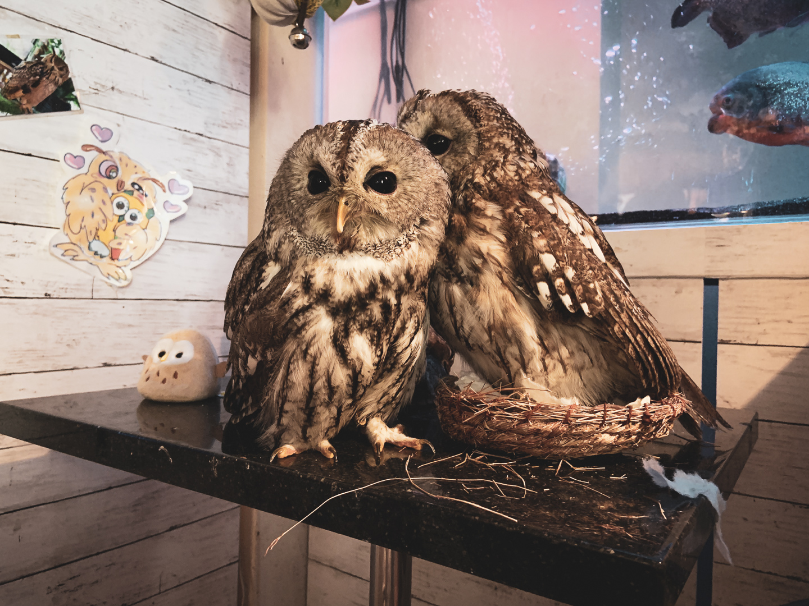

This post is going to be very technical and is intended for people interested in publishing their own website.

Quite recently I have completely rewritten the stack behind Owl Path, migrating the codebase from Jekyll to [Gatsby](https://www.gatsbyjs.org) (I'm sorry Jekyll, but you just don't get enough love and care anymore 😪). This was mainly motivated by various issues that we had with Ruby gems every now and then, but paved the way for a new publishing pipeline.

Previously we abused Instagram as a simple way to push content and then liberate it using my own [instant-liberation](https://github.com/aengl/instant-liberation). But now that I've recently acquired an actual smartphone I wanted see if I can make it such that we no longer depend on social media at all.

The solution turned out to be quite simple: use [Resilio Sync](https://www.resilio.com/) to sync photos between the smartphone and the publishing device.

Gatsby then turns the gallery folder (along with the calendar and blog posts) into a data source. These data sources are then queried using [GraphQL](https://graphql.org) directly from [React](https://reactjs.org) components. The entire thing is then published as a serverless build using Zeit's [Now](https://zeit.co/now).

Overkill, you say? Probably, but in the modern web there's no such thing as a _simple_ website anymore. Not if you do them right, anway. At the very least, you want your images automatically converted to the correct sizes, along with the corresponding `srcset` definitions. Jekyll is already choking hard at this point.

Also, as a Factorio player that word [isn't even in my dictionary](https://www.reddit.com/r/factorio/comments/bjhkob/early_game_overkill_i_have_perfected_furnaces/em891su/).

I encourage you look at the [data source configuration](https://github.com/aengl/owlpath/blob/master/gatsby-config.js) as well as the [GraphQL queries](https://github.com/aengl/owlpath/blob/master/src/pages/index.js) that interact with them. Note that image assets are automatically resized via GraphQL endpoints. It's pretty magical ✨!

I'm very happy with this new stack so far. And I'm quite sure you'll see new photos much more frequently now.
