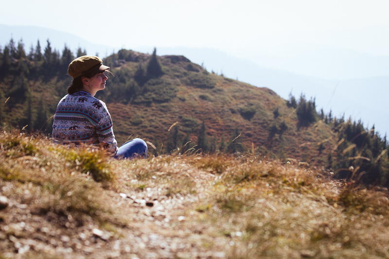

> I shall be telling this with a sigh 
> Somewhere ages and ages hence: 
> Two roads diverged in a wood, and I— 
> I took the one less traveled by, 
> And that has made all the difference.

(Excerpt from [The Road Not Taken](https://www.poetryfoundation.org/poems/44272/the-road-not-taken) by Robert Frost)

Some couple of months ago Lynn shared a poem with me which has stayed with me since. One of the reasons why this resonates with me so much is I think because I see more choices in life than most people I know: should I stay in Romania, or should I go somewhere else? Should I buy a house? Should I even rent one? 🙂

The level of disconnect between the lifestyle we're experimenting with right now (travelling as digital nomads) and what some of my family consider choices in life is best described by the number of times I was asked:

> But... you are going to settle one day. RIGHT?

I'm not even sure we're talking about not being able to see the choices. I think it might be more in the direction of not seeing the point of experimentation. Or following the good old romanian saying: Experimentation costs money. 🤔 Actually there isn't one... but it feels like there should be.

And it also goes in the other direction. I don't think all of us should be making the same choices. The path more traveled is sometimes more traveled because it fits people better. Don't spend your energy on every single choice you feel you should be making! Spend it on the choices that you really want to make!

And don't look back...

Toodles ❤️, _Cami_ 🐢
